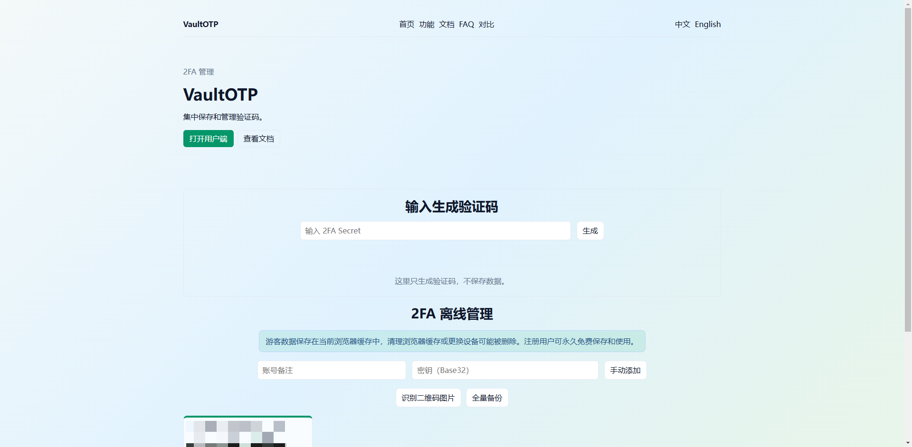
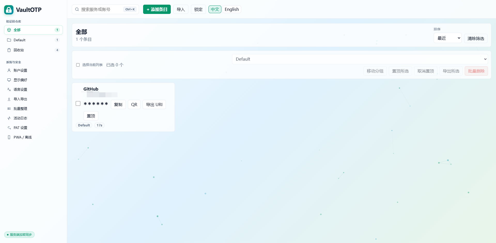
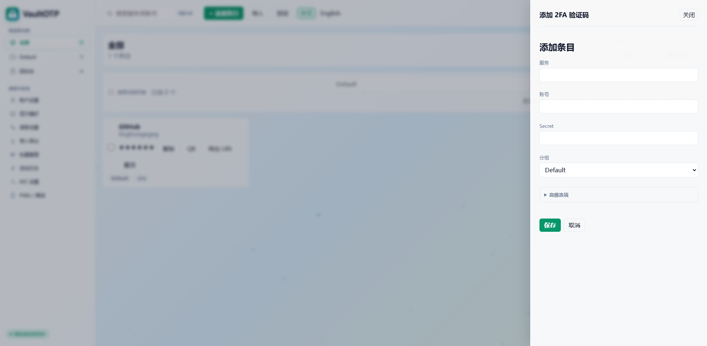
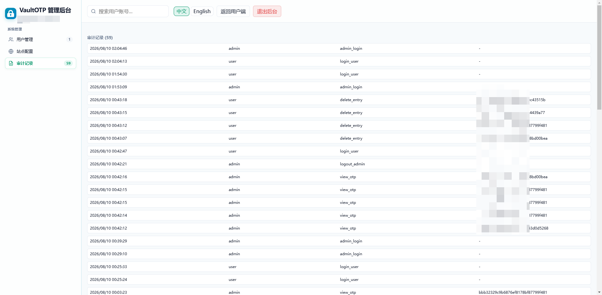

<div align="center">

# VaultOTP

集中保存、管理和使用 2FA 验证码的轻量 Web 工具。

<p>
  
  
  
  
  
</p>

</div>

## 项目简介

VaultOTP 是一个面向个人和团队的 2FA 验证码管理工具。它提供用户端、管理后台、公开工具页、浏览器扩展和 PWA 离线能力，适合自部署在自己的服务器上，用一个 Web 服务集中管理 TOTP/HOTP 条目、导入导出备份、通过 PAT 调用 API。

官网地址：[https://www.2fakey.icu/](https://www.2fakey.icu/)

## 项目特点

- **轻量自部署**：核心是一个 Node.js Web 服务，不依赖复杂微服务。
- **SQLite 持久化**：默认把用户、admin、分组、条目、PAT、审计记录保存到 SQLite。
- **完整用户端**：支持分组、搜索、置顶、回收站、批量整理、二维码导入、备份导出。
- **管理后台**：支持用户管理、站点配置、审计记录、用户详情查看。
- **安全边界清晰**：用户侧和 admin 侧分离；admin 查看 Secret / OTP 会进入审计链路。
- **算法覆盖完整**：支持 TOTP / HOTP，支持 SHA-1、SHA-256、SHA-512，支持 6 / 8 位验证码、TOTP 周期和 HOTP counter。
- **导入方式丰富**：支持 otpauth URI、Google Authenticator migration URI、二维码图片、摄像头扫码，以及常见可读导出格式。
- **API / PAT**：支持为当前用户创建 Personal Access Token，通过接口读取条目和验证码。
- **PWA / 离线体验**：可缓存应用外壳，弱网或离线时保留可用入口。
- **中英文界面**：内置中文和 English 文案，适合公开部署。

## 支持的算法

| 类型 | 支持项 |
| --- | --- |
| 验证码类型 | TOTP、HOTP |
| HMAC 算法 | SHA-1、SHA-256、SHA-512 |
| 验证码位数 | 6 位、8 位 |
| TOTP 参数 | 自定义周期，默认 30 秒 |
| HOTP 参数 | counter 计数器 |

## 支持的导入

| 导入来源 | 支持情况 |
| --- | --- |
| otpauth URI | 支持粘贴文本、批量文本、页面提取 |
| Google Authenticator | 支持 `otpauth-migration://` migration URI |
| 二维码图片 | 支持上传图片识别 |
| 摄像头扫码 | 支持浏览器摄像头实时扫码 |
| Aegis | 支持可读 JSON 导出 |
| 2FAS | 支持可读导出 |
| 2FAuth | 支持可读导出 |
| Bitwarden | 支持可读 JSON 导出 |
| LastPass | 支持 CSV 导出 |
| Proton Pass | 支持可读 JSON / CSV 导出 |
| Raivo | 支持可读导出 |
| andOTP | 支持可读导出 |
| FreeOTP | 支持可读导出 |

## 功能截图

| 首页 | 用户端 |
| --- | --- |
| <kbd></kbd> | <kbd></kbd> |

| 添加条目 | 管理后台 |
| --- | --- |
| <kbd></kbd> | <kbd></kbd> |

## 架构

```text
Browser / PWA / Extension
        |
        | HTTPS
        v
Node.js Web Server
  - Public pages
  - User app
  - Admin console
  - REST API
        |
        v
SQLite Store
  - users / admin
  - sessions / PAT
  - groups / entries
  - audit logs / site settings
```

### 目录说明

```text
web/        Web 页面、API 服务、PWA 文件
extension/  浏览器扩展和共享 i18n 文案
img/        项目截图、赞赏码、联系方式二维码
```

## 快速部署

### 环境要求

- Node.js 20+
- SQLite 支持：
  - Node.js 支持 `node:sqlite` 时会优先使用内置 SQLite。
  - Node.js 20 环境可安装系统 `sqlite3` 命令作为 fallback。

Ubuntu 示例：

```bash
sudo apt-get update
sudo apt-get install -y sqlite3
```

### 启动服务

```bash
HOST=127.0.0.1 \
PORT=4173 \
VAULTOTP_STORE_PATH=/var/lib/vaultotp/vaultotp-store.json \
node web/server.mjs
```

默认会在 `VAULTOTP_STORE_PATH` 同目录生成 SQLite 文件：

```text
/var/lib/vaultotp/vaultotp-store.sqlite
```

### 反向代理

生产环境建议用 Nginx / Caddy / Traefik 做 HTTPS 反代：

```nginx
server {
  listen 80;
  server_name example.com;

  location / {
    proxy_pass http://127.0.0.1:4173;
    proxy_set_header Host $host;
    proxy_set_header X-Forwarded-Proto $scheme;
    proxy_set_header X-Forwarded-For $proxy_add_x_forwarded_for;
  }
}
```

### systemd 示例

```ini
[Unit]
Description=VaultOTP web service
After=network.target

[Service]
WorkingDirectory=/opt/vaultotp/current
ExecStart=/usr/bin/node /opt/vaultotp/current/web/server.mjs
Restart=always
Environment=HOST=127.0.0.1
Environment=PORT=4173
Environment=VAULTOTP_STORE_PATH=/var/lib/vaultotp/vaultotp-store.json

[Install]
WantedBy=multi-user.target
```

## 常用配置

| 环境变量 | 默认值 | 说明 |
| --- | --- | --- |
| `HOST` | `127.0.0.1` | 监听地址 |
| `PORT` | `4173` | 监听端口 |
| `VAULTOTP_STORE_PATH` | `vaultotp-store.json` | 旧 JSON 路径和 SQLite 派生路径 |
| `VAULTOTP_DB_PATH` | 从 `VAULTOTP_STORE_PATH` 派生 | 显式指定 SQLite 文件路径 |
| `VAULTOTP_SQLITE_BIN` | `sqlite3` | Node 20 fallback 使用的 sqlite3 命令 |
| `VAULTOTP_DISABLE_DB` | 未设置 | 设置为 `1` 可回退 JSON 保存 |

## 项目推荐

[Linghun](https://github.com/linghungegeg/Linghun) 是一个本地优先、证据优先的 AI 编程终端，把大模型接到真实项目、真实工具、真实验证和真实上下文里。

## 开源协议

本项目基于 [Apache License 2.0](LICENSE) 开源。

## 赞赏

<p align="center">
  <kbd></kbd>
</p>

## 联系方式

<p align="center">
  <kbd></kbd>
</p>
